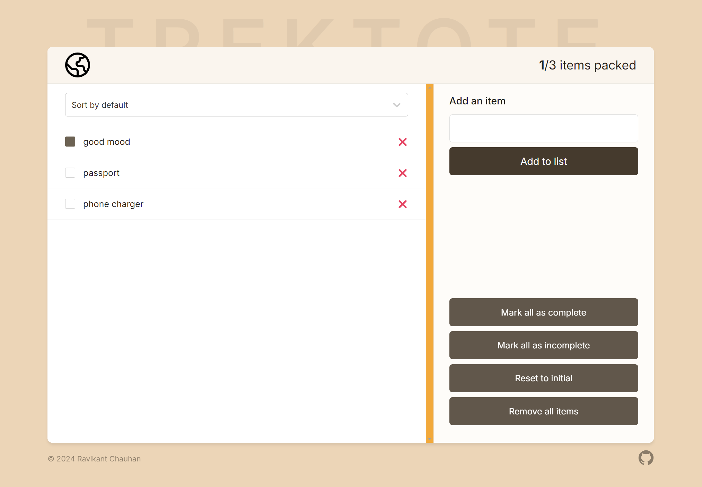

# TrekTote



## Purpose
This project is a simple React application designed to demonstrate the use of context providers, component composition, and state management. It includes a header, item list, sidebar, and footer, all wrapped within a context provider to manage the state of items.

## Technologies
- **React**: A JavaScript library for building user interfaces.
- **JavaScript (ES6+)**: The programming language used for the logic.
- **HTML5**: The markup language for structuring the web content.
- **CSS3**: The style sheet language for designing the web content.
- **Context API**: For state management across the application.

## Getting Started
To get a local copy up and running follow these simple steps.

### Prerequisites
- Node.js
- npm (Node Package Manager)

### Installation
1. Clone the repo
   ```sh
   git clone https://github.com/your_username/your_repo.git
   ```
2. Install NPM packages
   ```sh
   npm install
   ```

### Usage
1. Start the development server
   ```sh
   npm start
   ```
2. Open your browser and navigate to `http://localhost:3000`


